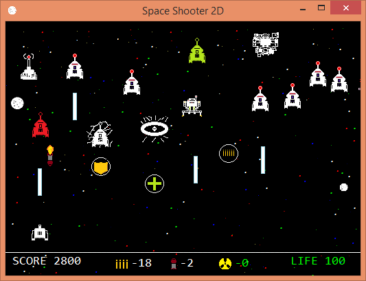

# Space_Shooter
My own version of space invaders written using java to ease my boredom during CS practical lab sessions.
I wrote the entire program with no notion of actual game programming but with a curiosity to learn animations and special effects.
The game is complete with Cheat Codes, Consecutive Damage Protection, Shields ,Heads-Up Display, Power-Ups, Boss levels and different classes of enemies and weapons.  

## Overview
 Requirements :
 
     jdk 1.7 or higher.
  
     Windows 8, 8.1
  
     Netbeans IDE
 
      
   
      
  
# Author

 Michel Thomas.
 
# License
 
 GNU General Public License, version 2.

# Acknowledgments

 Space Invaders(1978) by Tomohiro Nishikado.
 
 Object Oriented Programming with C++ by Robert Lafore.
 
 Introduction to Java Programming by David J Eck.
